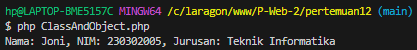
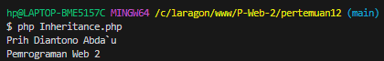
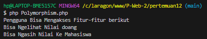
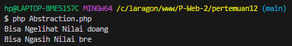

# OOP PHP

## Apa itu OOP?

Pemrograman Berorientasi Objek (OOP) adalah paradigma pemrograman yang mengorganisasi kode menjadi objek-objek. Objek ini merepresentasikan entitas dunia nyata, seperti mobil, orang, atau bahkan konsep abstrak seperti akun bank. Setiap objek memiliki atribut (data) dan metode (fungsi) yang terkait.

## Konsep Dasar OOP

Class: Blueprint atau cetak biru untuk membuat objek. Kelas mendefinisikan atribut dan metode yang akan dimiliki oleh objek.

```php
class Mahasiswa {
...

?>
```

Object: Instansi dari sebuah kelas. Setiap objek memiliki nilai atribut yang unik.
```php
$mahasiswa = new Mahasiswa("Joni", 230302005, "Teknik Informatika");
$mahasiswa->tampilkanData();

// Memanggil metode tampilkanData() untuk menampilkan data mahasiswa
$mahasiswa->tampilkanData();

```

Attribute: Properti atau karakteristik dari sebuah objek.

```php
public $nama, $nim, $jurusan;

```


Method: Fungsi yang terkait dengan objek, digunakan untuk mengubah atau mengakses atribut.

```php
public function tampilkanData(){
        echo "Nama: $this->nama, NIM: $this->nim, Jurusan: $this->jurusan";
    }
```

Contoh Lengkap

```php

<?php 

class Mahasiswa{
    public $nama, $nim, $jurusan; // Deklarasi properti publik untuk menyimpan data mahasiswa

    // Konstruktor untuk menginisialisasi objek Mahasiswa dengan nama, NIM, dan jurusan
    public function __construct($nama, $nim, $jurusan){
        $this->nama = $nama;  // Mengisi properti $nama dengan nilai parameter $nama
        $this->nim = $nim;    // Mengisi properti $nim dengan nilai parameter $nim
        $this->jurusan = $jurusan; // Mengisi properti $jurusan dengan nilai parameter $jurusan
    }

    // Metode untuk menampilkan data mahasiswa
    public function tampilkanData(){
        echo "Nama: $this->nama, NIM: $this->nim, Jurusan: $this->jurusan"; // Mencetak data mahasiswa dalam format string
    }
}

// Membuat objek Mahasiswa dengan nama, NIM, dan jurusan tertentu
$mahasiswa = new Mahasiswa("Joni", 230302005, "Teknik Informatika");

// Memanggil metode tampilkanData() untuk menampilkan data mahasiswa
$mahasiswa->tampilkanData();


```

Hasil :



Inheritance: Mekanisme di mana sebuah kelas (kelas anak) mewarisi atribut dan metode dari kelas lain (kelas induk).

```php
<?php 

class Pengguna{
    protected $nama;

    public function __construct(string $nama){
        $this->nama = $nama;
    }   

    public function getNama() {
        return $this->nama  . PHP_EOL;
    }
}

class Dosen extends Pengguna{
    private $matakuliah;

    public function __construct($nama, $matakuliah){
        parent::__construct($nama);
        $this->matakuliah = $matakuliah;
    }

    public function getMatkul(){
        return $this->matakuliah;
    }
}

$dosen = new Dosen("Prih Diantono Abda`u","Pemrograman Web 2");
echo $dosen->getNama();
echo $dosen->getMatkul();
```

Hasil :



Polimorphism: Kemampuan suatu objek untuk mengambil banyak bentuk.

```php
class Pengguna{
    // Konstruktor kelas Pengguna
    public function __construct(){

    }

    // Metode untuk menampilkan fitur yang bisa diakses oleh pengguna
    public function aksesFitur(){
        echo "Pengguna Bisa Mengakses Fitur-fitur berikut". PHP_EOL; // Mencetak pesan akses fitur untuk pengguna umum
    }
}

class Dosen extends Pengguna{
    // Konstruktor kelas Dosen
    public function __construct(){

    }

    // Metode untuk menampilkan fitur yang bisa diakses oleh dosen
    public function aksesFitur(){
        echo "Bisa Ngasih Nilai Ke Mahasiswa" . PHP_EOL; // Mencetak pesan akses fitur spesifik untuk dosen
    }
}

class Mahasiswa extends Pengguna{
    // Konstruktor kelas Mahasiswa
    public function __construct(){
    
    }

    // Metode untuk menampilkan fitur yang bisa diakses oleh mahasiswa
    public function aksesFitur(){
        echo "Bisa Ngelihat Nilai doang" . PHP_EOL; // Mencetak pesan akses fitur spesifik untuk mahasiswa
    }
}

// Membuat array yang berisi objek dari kelas Pengguna, Mahasiswa, dan Dosen
$users = [new Pengguna(), new Mahasiswa(), new Dosen()];

// Melakukan iterasi pada setiap objek di array $users
foreach ($users as $user) {
    $user->aksesFitur(); // Memanggil metode aksesFitur() sesuai dengan kelas dari objek yang bersangkutan
}

```

Hasil :



Encaptulation: Membungkus data (atribut) dan metode dalam sebuah kelas, sehingga data terlindungi dari akses langsung.

```php
private $id;
public $nama;
protected function class MyFunction(){
...
```


Abstraction: Proses menyembunyikan detail implementasi internal dan
hanya menampilkan fungsionalitas utama kepada pengguna. 

```php
<?php 

abstract class Pengguna{
    // Mendefinisikan sebuah metode abstrak yang harus diimplementasikan oleh kelas turunan
    abstract protected function aksesFitur();
}

class Mahasiswa extends Pengguna{
    public function __construct(){
        // Konstruktor kelas Mahasiswa, saat ini tidak melakukan apapun
    }

    // Implementasi metode abstrak dari kelas Pengguna
    public function aksesFitur() {
        return "Bisa Ngelihat Nilai doang" . PHP_EOL; // Mengembalikan string dengan fitur yang dapat diakses oleh Mahasiswa
    }
}

class Dosen extends Pengguna{
    public function __construct(){
        // Konstruktor kelas Dosen, saat ini tidak melakukan apapun
    }

    // Implementasi metode abstrak dari kelas Pengguna
    public function aksesFitur(){
        return "Bisa Ngasih Nilai bre" . PHP_EOL; // Mengembalikan string dengan fitur yang dapat diakses oleh Dosen
    }
}

$users = [new Mahasiswa(), new Dosen()]; // Membuat array berisi objek Mahasiswa dan Dosen

foreach ($users as $user) {
    echo $user->aksesFitur(); // Memanggil metode aksesFitur() untuk setiap objek dan mencetak hasilnya
}

```

Hasil :



## Penerapan OOP dalam PHP

Framework PHP: Hampir semua framework PHP (Laravel, CodeIgniter, Symfony) menggunakan konsep OOP secara ekstensif.
Aplikasi Web: OOP sangat berguna untuk membangun aplikasi web yang kompleks dengan banyak fitur.
Permainan: OOP digunakan untuk membuat karakter, objek, dan interaksi dalam permainan.

## Manfaat Menggunakan OOP dalam PHP

Kode yang lebih bersih dan terstruktur: OOP membantu dalam membuat kode yang lebih mudah dibaca dan dipahami.
Meningkatkan produktivitas: Dengan menggunakan kembali kode, pengembang dapat lebih produktif.
Memudahkan dalam kolaborasi: OOP memungkinkan tim pengembang untuk bekerja sama dengan lebih efektif.
