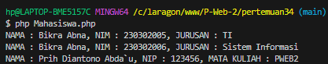

# OOP PHP

## Apa itu OOP?

Pemrograman Berorientasi Objek (OOP) adalah paradigma pemrograman yang mengorganisasi kode menjadi objek-objek. Objek ini merepresentasikan entitas dunia nyata, seperti mobil, orang, atau bahkan konsep abstrak seperti akun bank. Setiap objek memiliki atribut (data) dan metode (fungsi) yang terkait.

## Konsep Dasar OOP 2

Class: Blueprint atau cetak biru untuk membuat objek. Kelas mendefinisikan atribut dan metode yang akan dimiliki oleh objek.

```php
class Mahasiswa {
...

?>
```

Object: Instansi dari sebuah kelas. Setiap objek memiliki nilai atribut yang unik.

```php
$mahasiswa = new Mahasiswa("Joni", 230302005, "Teknik Informatika");
$mahasiswa->tampilkanData();

// Memanggil metode tampilkanData() untuk menampilkan data mahasiswa
$mahasiswa->tampilkanData();

```

Constructor : Method yang langsung dijalankan saat objed di Instansiasi pertama kali.

```php

public function __construct($nama, $nim, $jurusan){
        $this->nama = $nama;
        $this->nim = $nim;
        $this->jurusan = $jurusan;
    }

```

Attribute: Properti atau karakteristik dari sebuah objek.

```php
public $nama, $nim, $jurusan;

```


Method: Fungsi yang terkait dengan objek, digunakan untuk mengubah atau mengakses atribut.

```php
public function tampilkanData(){
        echo "Nama: $this->nama, NIM: $this->nim, Jurusan: $this->jurusan";
    }
```

Contoh Lengkap

```php

<?php 

class Mahasiswa {
    private $nama, $nim, $jurusan; // Deklarasi properti private untuk menyimpan data mahasiswa

    // Konstruktor untuk menginisialisasi objek Mahasiswa dengan nama, NIM, dan jurusan
    public function __construct($nama, $nim, $jurusan){
        $this->nama = $nama;
        $this->nim = $nim;
        $this->jurusan = $jurusan;
    }

    // Metode untuk menampilkan data mahasiswa dalam format string
    public function tampilData(){
        return "NAMA : $this->nama, NIM : $this->nim, JURUSAN : $this->jurusan";
    }

    // Metode untuk mengupdate jurusan mahasiswa
    public function updateJurusan($jurusan){
        $this->jurusan = $jurusan;
    }

    // Metode untuk mengupdate NIM mahasiswa
    public function setNim($nim){
        $this->nim = $nim;
    }
}

class Dosen{
    protected $nama, $nip, $matkul; // Deklarasi properti protected untuk menyimpan data dosen

    // Konstruktor untuk menginisialisasi objek Dosen dengan nama, NIP, dan mata kuliah
    public function __construct($nama, $nip, $matkul){
        $this->nama = $nama;
        $this->nip = $nip;
        $this->matkul = $matkul;
    }

    // Metode untuk menampilkan data dosen dalam format string
    public function tampilkanDosen(){
        return "NAMA : $this->nama, NIP : $this->nip, MATA KULIAH : $this->matkul";
    }
}

// Membuat objek Mahasiswa dengan nama, NIM, dan jurusan tertentu
$mahasiswa = new Mahasiswa("Bikra Abna", 230302005, "TI");
echo $mahasiswa->tampilData() . PHP_EOL; // Menampilkan data mahasiswa

// Mengupdate jurusan mahasiswa
$mahasiswa->updateJurusan("Sistem Informasi");

// Mengupdate NIM mahasiswa
$mahasiswa->setNim(230302006);

// Menampilkan data mahasiswa setelah diupdate
echo $mahasiswa->tampilData(). PHP_EOL;

// Membuat objek Dosen dengan nama, NIP, dan mata kuliah tertentu
$dosen = new Dosen("Prih Diantono Abda`u",123456,"PWEB2");

// Menampilkan data dosen
echo $dosen->tampilkanDosen();

```

Hasil :




## Penerapan OOP dalam PHP

Framework PHP: Hampir semua framework PHP (Laravel, CodeIgniter, Symfony) menggunakan konsep OOP secara ekstensif.
Aplikasi Web: OOP sangat berguna untuk membangun aplikasi web yang kompleks dengan banyak fitur.
Permainan: OOP digunakan untuk membuat karakter, objek, dan interaksi dalam permainan.

## Manfaat Menggunakan OOP dalam PHP

Kode yang lebih bersih dan terstruktur: OOP membantu dalam membuat kode yang lebih mudah dibaca dan dipahami.
Meningkatkan produktivitas: Dengan menggunakan kembali kode, pengembang dapat lebih produktif.
Memudahkan dalam kolaborasi: OOP memungkinkan tim pengembang untuk bekerja sama dengan lebih efektif.
