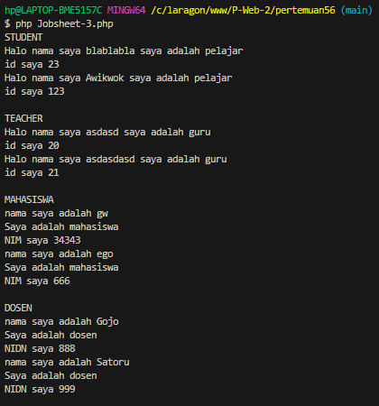

# OOP PHP

## Apa itu OOP?

Pemrograman Berorientasi Objek (OOP) adalah paradigma pemrograman yang mengorganisasi kode menjadi objek-objek. Objek ini merepresentasikan entitas dunia nyata, seperti mobil, orang, atau bahkan konsep abstrak seperti akun bank. Setiap objek memiliki atribut (data) dan metode (fungsi) yang terkait.

## Konsep Dasar OOP 3


Inheritance: Mekanisme di mana sebuah kelas (kelas anak) mewarisi atribut dan metode dari kelas lain (kelas induk).

```php
<?php 

class Person{
    
    ...

}

class Student extends Person{
    
    ...

}
```

Polimorphism: Kemampuan suatu objek untuk mengambil banyak bentuk.

```php
class Student extends Person{
    ...

    public function getName(){
        return "Halo nama saya " . parent::getName() ." saya adalah pelajar" . PHP_EOL;
    }
    ...
}

class Teacher extends Person{
    ...

    public function getName(){
        return "Halo nama saya " . parent::getName() . " saya adalah guru" . PHP_EOL;
    }

    ...
}

```

Enkapsulasi: Konsep dalam pemrograman berorientasi objek yang membungkus data (properti) dan metode (fungsi) dalam satu unit yang disebut kelas.

Visibilitas: Tingkat aksesibilitas suatu anggota kelas (properti atau metode) dari bagian lain dari program. Terdiri dari public, protected, dan private.

Aksesibilitas: Kemampuan suatu bagian dari kode untuk mengakses bagian lain.

```php
class Person{
    private $name;

    protected function setName(string $name){
        $this->name = $name;
    }

    public function getRole(){
        return "Person";
    }
}

```

Abstraction: Proses menyembunyikan detail implementasi internal dan hanya menampilkan fungsionalitas utama kepada pengguna. 

```php
abstract class Course{
    // Method abstract yang harus diimplementasikan oleh class turunannya.
    abstract function getCourseDetail();
}

```

Code Lengkap :

```php

<?php

// Definisikan class Person sebagai class dasar untuk representasi orang.
class Person{
    // Properti private untuk menyimpan nama orang.
    private $name;

    // Constructor untuk inisialisasi objek dengan nama.
    public function __construct($name){
        $this->name = $name;
    }

    // Method public untuk mendapatkan nama orang.
    public function getName(){
        return $this->name;
    }

    // Method protected untuk mengubah nama orang (hanya bisa diakses oleh class ini dan turunannya).
    protected function setName(string $name){
        $this->name = $name;
    }

    // Method public untuk mendapatkan peran orang, default-nya adalah "Person".
    public function getRole(){
        return "Person";
    }
}

// Definisikan class Student sebagai turunan dari class Person.
class Student extends Person{
    // Properti private untuk menyimpan studentID (ID siswa).
    private $studentID;

    // Constructor untuk inisialisasi objek Student dengan nama dan ID siswa.
    public function __construct(string $name, int $studentID){
        // Panggil constructor parent class untuk inisialisasi nama.
        parent::__construct($name);
        $this->studentID = $studentID;
    }
    
    // Method public untuk mengubah nama siswa.
    public function setName(string $name){
        parent::setName($name);
    }
    
    // Method public untuk mengubah studentID.
    public function setStudentID(int $id){
        $this->studentID = $id;
    }

    // Method public untuk mendapatkan studentID.
    public function getStudentId(){
        return "id saya $this->studentID " . PHP_EOL;
    }

    // Method public untuk mendapatkan nama siswa dengan tambahan keterangan bahwa dia adalah siswa.
    public function getName(){
        return "Halo nama saya " . parent::getName() . " saya adalah pelajar" . PHP_EOL;
    }
}

// Definisikan class Teacher sebagai turunan dari class Person.
class Teacher extends Person{
    // Properti private untuk menyimpan teacherID (ID guru).
    private $teacherID;

    // Constructor untuk inisialisasi objek Teacher dengan nama dan ID guru.
    public function __construct(string $name, int $teacherID){
        // Panggil constructor parent class untuk inisialisasi nama.
        parent::__construct($name);
        $this->teacherID = $teacherID;
    }

    // Method public untuk mengubah nama guru.
    public function setName(string $name){
        parent::setName($name);
    }

    // Method public untuk mengubah teacherID.
    public function setTeacherID(int $id){
        $this->teacherID = $id;
    }

    // Method public untuk mendapatkan nama guru dengan tambahan keterangan bahwa dia adalah guru.
    public function getName(){
        return "Halo nama saya " . parent::getName() . " saya adalah guru" . PHP_EOL;
    }

    // Method public untuk mendapatkan teacherID.
    public function getID(){
        return "id saya $this->teacherID" . PHP_EOL;
    }
}

// Definisikan class Dosen sebagai turunan dari class Person.
class Dosen extends Person{
    // Properti private untuk menyimpan NIDN (Nomor Induk Dosen Nasional).
    private $nidn;

    // Constructor untuk inisialisasi objek Dosen dengan nama dan NIDN.
    public function __construct(string $name, int $nidn){
        // Panggil method setName dari parent class untuk menginisialisasi nama.
        parent::setName($name);
        $this->nidn = $nidn;
    }

    // Method public untuk mengubah nama dosen.
    public function setName(string $name){
        parent::setName($name);
    }

    // Method public untuk mendapatkan nama dosen.
    public function getName(){
        return "nama saya adalah " . parent::getName() . PHP_EOL;
    }

    // Method public untuk mengubah NIDN.
    public function setNIDN(int $nidn){
        $this->nidn = $nidn;
    }

    // Method public untuk mendapatkan NIDN.
    public function getNIDN(){
        return "NIDN saya $this->nidn" . PHP_EOL;
    }

    // Method public untuk mendapatkan peran dosen.
    public function getRole(){
        return "Saya adalah dosen" . PHP_EOL;
    }
}

// Definisikan class Mahasiswa sebagai turunan dari class Person.
class Mahasiswa extends Person{
    // Properti private untuk menyimpan NIM (Nomor Induk Mahasiswa).
    private $nim;

    // Constructor untuk inisialisasi objek Mahasiswa dengan nama dan NIM.
    public function __construct(string $name, int $nim){
        // Panggil method setName dari parent class untuk menginisialisasi nama.
        parent::setName($name);
        $this->nim = $nim;
    }

    // Method public untuk mengubah NIM.
    public function setNIM(int $nim){
        $this->nim = $nim;
    }

    // Method public untuk mengubah nama mahasiswa.
    public function setName(string $name){
        parent::setName($name);
    }

    // Method public untuk mendapatkan NIM.
    public function getNIM(){
        return "NIM saya $this->nim" . PHP_EOL;
    }

    // Method public untuk mendapatkan nama mahasiswa.
    public function getName(){
        return "nama saya adalah " . parent::getName() . PHP_EOL;
    }

    // Method public untuk mendapatkan peran mahasiswa.
    public function getRole(){
        return "Saya adalah mahasiswa" . PHP_EOL;
    }
}

// Definisikan class abstract Course sebagai template untuk class lain.
abstract class Course{
    // Method abstract yang harus diimplementasikan oleh class turunannya.
    abstract function getCourseDetail();
}

// Definisikan class OnlineCourse sebagai turunan dari class Course.
class OnlineCourse extends Course{
    // Constructor kosong.
    public function __construct(){

    }

    // Implementasi method getCourseDetail untuk kelas online.
    public function getCourseDetail(){
        return "ini adalah kelas online" . PHP_EOL;
    }
}

// Definisikan class OfflineCourse sebagai turunan dari class Course.
class OfflineCourse extends Course{
    // Constructor kosong.
    public function __construct(){
    }

    // Implementasi method getCourseDetail untuk kelas offline.
    public function getCourseDetail(){
        return "ini adalah kelas offline" . PHP_EOL;
    }
}

// Membuat objek Student dan menampilkan informasi terkait.
echo "STUDENT" . PHP_EOL;

$student = new Student("blablabla", 23 );
echo $student->getName();
echo $student->getStudentId();

// Ubah nama dan studentID pada objek Student, lalu tampilkan kembali informasinya.
$student->setName("Awikwok");
$student->setStudentID(123);
echo $student->getName();
echo $student->getStudentId() . PHP_EOL;

// Membuat objek Teacher dan menampilkan informasi terkait.
echo "TEACHER" . PHP_EOL;

$teacher = new Teacher("asdasd",20);
echo $teacher->getName();
echo $teacher->getID();

// Ubah nama dan teacherID pada objek Teacher, lalu tampilkan kembali informasinya.
$teacher->setName("asdasdasd");
$teacher->setTeacherId(21);
echo $teacher->getName();
echo $teacher->getID() . PHP_EOL;

// Membuat objek Mahasiswa dan menampilkan informasi terkait.
echo "MAHASISWA" . PHP_EOL;

$mahasiswa = new Mahasiswa("gw", 34343 );
echo $mahasiswa->getName();
echo $mahasiswa->getRole();
echo $mahasiswa->getNIM();

// Ubah nama dan NIM pada objek Mahasiswa, lalu tampilkan kembali informasinya.
$mahasiswa->setName("ego");
$mahasiswa->setNim(666);
echo $mahasiswa->getName();
echo $mahasiswa->getRole();
echo $mahasiswa->getNIM() . PHP_EOL;

// Membuat objek Dosen dan menampilkan informasi terkait.
echo "DOSEN" . PHP_EOL;

$dosen = new Dosen("Gojo", 888);
echo $dosen->getName();
echo $dosen->getRole();
echo $dosen->getNIDN();

// Ubah nama dan NIDN pada objek Dosen, lalu tampilkan kembali informasinya.
$dosen->setName("Satoru");
$dosen->setNidn(999);
echo $dosen->getName();
echo $dosen->getRole();
echo $dosen->getNIDN() . PHP_EOL;


```

Hasil :



## Penerapan OOP dalam PHP

Framework PHP: Hampir semua framework PHP (Laravel, CodeIgniter, Symfony) menggunakan konsep OOP secara ekstensif.
Aplikasi Web: OOP sangat berguna untuk membangun aplikasi web yang kompleks dengan banyak fitur.
Permainan: OOP digunakan untuk membuat karakter, objek, dan interaksi dalam permainan.

## Manfaat Menggunakan OOP dalam PHP

Kode yang lebih bersih dan terstruktur: OOP membantu dalam membuat kode yang lebih mudah dibaca dan dipahami.
Meningkatkan produktivitas: Dengan menggunakan kembali kode, pengembang dapat lebih produktif.
Memudahkan dalam kolaborasi: OOP memungkinkan tim pengembang untuk bekerja sama dengan lebih efektif.
